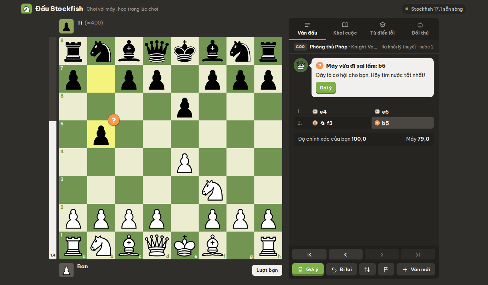
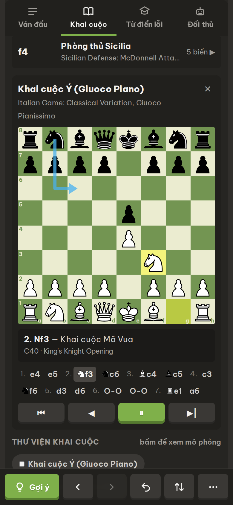

# Đấu Stockfish

Chơi cờ vua với máy và học ngay trong lúc chơi. Bố cục theo kiểu "chơi với máy" của các trang cờ lớn, toàn bộ bằng tiếng Việt, chạy hoàn toàn trong trình duyệt (không cần máy chủ).

**Bản chạy thật:** https://chess-bot-com.vercel.app



## Tính năng

- **12 bot từ ≈250 đến Siêu cấp** cùng mức Elo tùy chỉnh (1320–3190). Bot dưới 1320 dùng cách chọn nước "giống người": tìm kiếm nông, đôi khi đi hớ. Elo của các bot này là ước lượng.
- **Chấm điểm từng nước ngay khi đi:** Thiên tài !!, Nước hay !, Tốt nhất, Xuất sắc, Tốt, Lý thuyết, Không chính xác ?!, Sai lầm ?, Bỏ lỡ, Sai lầm nghiêm trọng ??. Ký hiệu hiện trên ô cờ và trong biên bản.
- **Huấn luyện viên:** giải thích vì sao sai (để mất quân, bị chĩa, bị chiếu hết…), chỉ nước tốt nhất, nút **Thử lại**, và mở bài học phù hợp trong từ điển. Khi máy đi sai, trang nhắc bạn tìm cách trừng phạt.
- **Thanh đánh giá, độ chính xác, tổng kết cuối ván**, cùng chế độ chấm điểm cả ván cho chế độ Thử thách.
- **Khai cuộc:** tên khai cuộc cho cả hai bên (3.815 biến từ dữ liệu lichess), ý tưởng bằng tiếng Việt, các nước lý thuyết tiếp theo, bàn cờ nhỏ mô phỏng, thư viện 19 khai cuộc phổ biến.
- **Từ điển lỗi:** 25 bài về bẫy khai cuộc, lỗi chiến thuật, mẫu chiếu hết và tàn cuộc. Bài nào cũng có mô phỏng từng nước kèm lời giải thích, và đã được kiểm tra bằng Stockfish.
- **Ba chế độ:** Học tập (đầy đủ trợ giúp, dừng lại khi bạn đi sai), Thân thiện, Thử thách (không trợ giúp).
- **Thao tác như trang cờ thật:** kéo thả (thả sai chỗ thì quân về chỗ cũ), bấm để đi, chuột phải để vẽ mũi tên và đánh dấu ô (trên điện thoại: chạm giữ rồi kéo), hiệu ứng trượt quân, âm thanh, xem lại nước bằng phím ← →.
- **Điện thoại:** thanh công cụ cố định ở đáy, bố cục riêng khi xoay ngang, rung khi ăn quân. Cài được như ứng dụng (PWA) và chơi được khi không có mạng.
- **Stockfish đa luồng:** trên Vercel, trang được bật cách ly (COOP/COEP) nên Stockfish chạy nhiều luồng, nhanh gấp 2–4 lần bản một luồng.



## Chạy thử trên máy

Không cần cài đặt gì. Cần một máy chủ tĩnh gửi đúng header để bật đa luồng:

```bash
python3 tools/serve.py 8080
# mở http://localhost:8080
```

`python3 -m http.server` cũng chạy được, nhưng khi đó Stockfish chỉ dùng một luồng.

## Triển khai lên Vercel

1. Vào https://vercel.com/new, chọn **Import** repo `chess-com`.
2. **Project Name:** `chess-bot-com` (Vercel không cho dùng dấu gạch dưới trong tên miền).
3. **Framework Preset:** Other. Để trống Build Command và Output Directory.
4. Bấm **Deploy**. Trang sẽ có ở `https://chess-bot-com.vercel.app` (nếu tên còn trống). Mỗi lần push lên nhánh `main`, Vercel tự triển khai lại.

`vercel.json` đã cấu hình sẵn header cách ly (COOP/COEP) để chạy đa luồng, cùng cache dài hạn cho engine và font.

## Cấu trúc

```
index.html            trang chính
app/main.js           điều phối ván cờ, giao diện, lịch chạy engine
app/board.js          bàn cờ: kéo thả, mũi tên, đánh dấu, hiệu ứng
app/engine.js         điều khiển Stockfish qua Web Worker (một hoặc nhiều luồng)
app/review.js         chấm điểm nước đi và lời giải thích
app/bots.js           danh sách bot và cách bot yếu chọn nước
app/openings.js       tra cứu khai cuộc + ghi chú tiếng Việt
app/lessons.js        từ điển lỗi
app/sound.js          âm thanh tổng hợp bằng Web Audio
data/openings.json    dữ liệu khai cuộc đã nén theo thế cờ
engine/               Stockfish 17.1 (lite, một luồng / đa luồng / asm.js dự phòng)
sw.js, manifest.webmanifest, icons/   ứng dụng cài được, chơi offline
tools/                dựng dữ liệu khai cuộc, kiểm tra từ điển, máy chủ thử, bản cho Claude artifact
```

## Cách chấm điểm

Mỗi nước được so với nước tốt nhất của Stockfish theo **xác suất thắng** (công thức của lichess), nên mất một tốt ở thế cân bằng bị chấm nặng hơn nhiều so với khi ván đã ngã ngũ. Nước thí quân chính xác được gắn nhãn Thiên tài. Nước duy nhất giữ được thế cờ được gắn nhãn Nước hay. Nước nằm trong sách khai cuộc và không làm xấu thế cờ được gắn nhãn Lý thuyết. Các nhãn này do trang tự tính nên sẽ không khớp tuyệt đối với các trang cờ khác.

## Giấy phép và ghi công

- Mã nguồn: GPL-3.0 (xem `LICENSE`), vì dự án kèm Stockfish.
- [Stockfish](https://stockfishchess.org) 17.1 qua [stockfish.js](https://github.com/nmrugg/stockfish.js) — GPL-3.0.
- [chess.js](https://github.com/jhlywa/chess.js) — BSD-2-Clause.
- Dữ liệu khai cuộc: [lichess-org/chess-openings](https://github.com/lichess-org/chess-openings) — CC0.
- Quân cờ: bộ cburnett của Colin M.L. Burnett — CC BY-SA 3.0.
- Phông chữ: Be Vietnam Pro — SIL Open Font License 1.1.

Dự án cá nhân để học cờ, không liên quan tới Chess.com hay bất kỳ trang cờ nào khác.
