# ♟️ Đấu Stockfish - Play & Learn Chess Against Stockfish

<div align="center">


**A browser chess trainer: play 12 Stockfish bots from ≈250 Elo to full strength, with every move graded live, a coach that explains your mistakes, openings, puzzles and a mistake dictionary. Vietnamese interface, no server, works offline.**

[](https://chess-training-com.vercel.app)

</div>

---

## ✨ Key Features

### Play 🎮

- **12 Bots + Custom Elo:** From Bé Na (≈250) to full-strength Stockfish, plus any Elo from 1320 to 3190. Bots under 1320 search shallowly and pick moves like a human, including the occasional blunder.
- **Live Move Grading:** Every move gets a label as you play: Brilliant !!, Great !, Best, Excellent, Good, Book, Inaccuracy ?!, Mistake ?, Miss and Blunder ??. The badge appears on the board and in the move list.
- **Coach:** Explains why a move was bad (hanging a piece, allowing a fork, walking into mate…), shows the best move, offers **Retry**, and links to the matching lesson.
- **Clocks & Time Controls:** Bullet, Blitz and Rapid (1|0 to 30|0, with increment). Stockfish manages its own time from `wtime`/`btime`, a low-time warning sounds, and running out of time loses (or draws if the opponent cannot mate).
- **Premoves:** Move during the bot's turn. Queue several moves; they play the moment it is your turn if still legal. Right-click to cancel.
- **Board That Feels Right:** The piece jumps to the centre of the cursor when you press it. Drag or click to move, with snap-back on illegal drops, animations and sounds. Right-click draws arrows and highlights (Shift, Ctrl, Alt change the colour). The mouse wheel steps through moves. Auto-queen and legal-move dots are optional.
- **Three Modes:** Learn (full help, pauses when you slip), Friendly, and Challenge (no help, full-game review afterwards).

### Learn 📚

- **Openings:** Names for both sides (3,815 lichess lines), 100+ Vietnamese guides with plans and traps, a 60-line library in 7 groups, and mini-board simulations. In Learn mode a card with a diagram tells you which opening you just entered.
- **Puzzles:** 5,706 real puzzles from the lichess database (mates, forks, pins, sacrifices, endgames…), filtered by theme and difficulty, with a personal puzzle rating that adjusts after each puzzle.
- **Mistake Dictionary:** 25 lessons on opening traps, tactical errors, mating patterns and endgames, each with a move-by-move simulation checked by Stockfish.
- **Game Review & Stats:** Accuracy and a move-class table at the end of every game. The Stats page records wins, draws and losses, accuracy, results per bot and a puzzle rating chart. Bots you have beaten get a ✓.

### Everywhere 📱

- **Responsive Layout:** Full sidebar on wide screens, an icon rail on laptops, and a slide-out menu, bottom toolbar and landscape layout on phones.
- **Installable & Offline:** Installs as an app (PWA). Engine, data and fonts are cached, so it works with no connection.
- **Multi-threaded Stockfish:** With COOP/COEP isolation the engine runs on several threads (2–4× faster than the single-threaded build), with automatic fallbacks.

---

## 📸 Application Screenshots

### 🖥️ Desktop

| **Play With Live Coaching** | **Blitz Clock & Premove** |
|:---:|:---:|
| 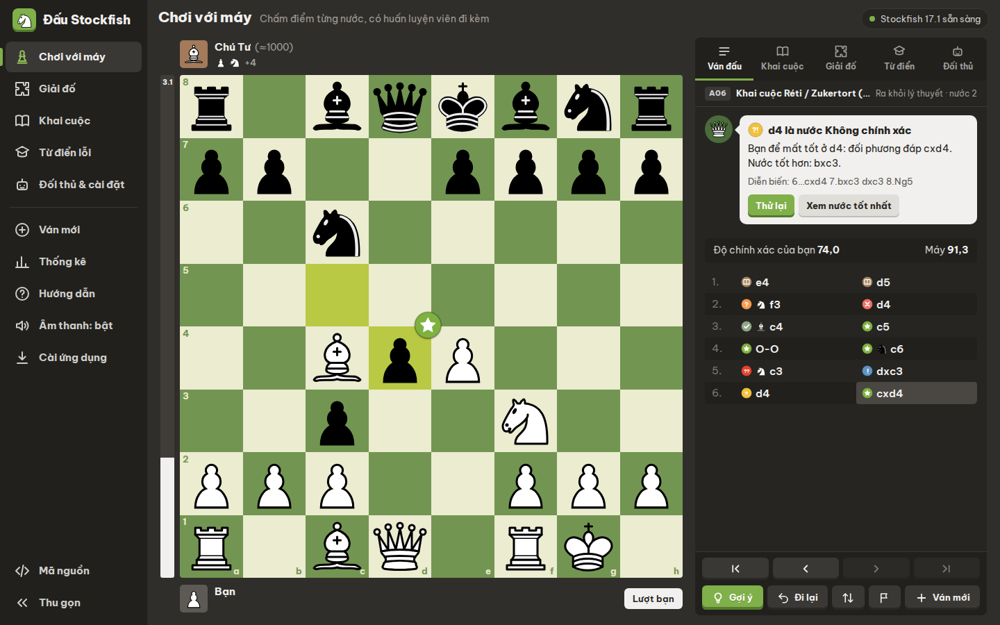 | 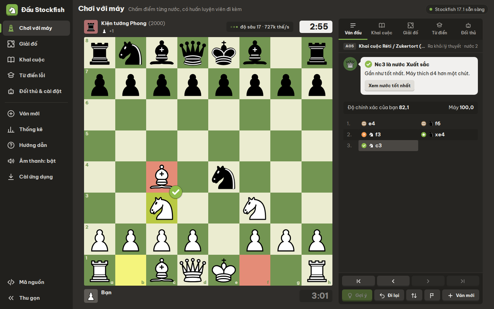 |
| *Move badges, coach feedback, accuracy and eval bar.* | *3\|2 clock; the queued premove Bc4 is shown in red.* |

| **Game Review** | **Stats** |
|:---:|:---:|
| 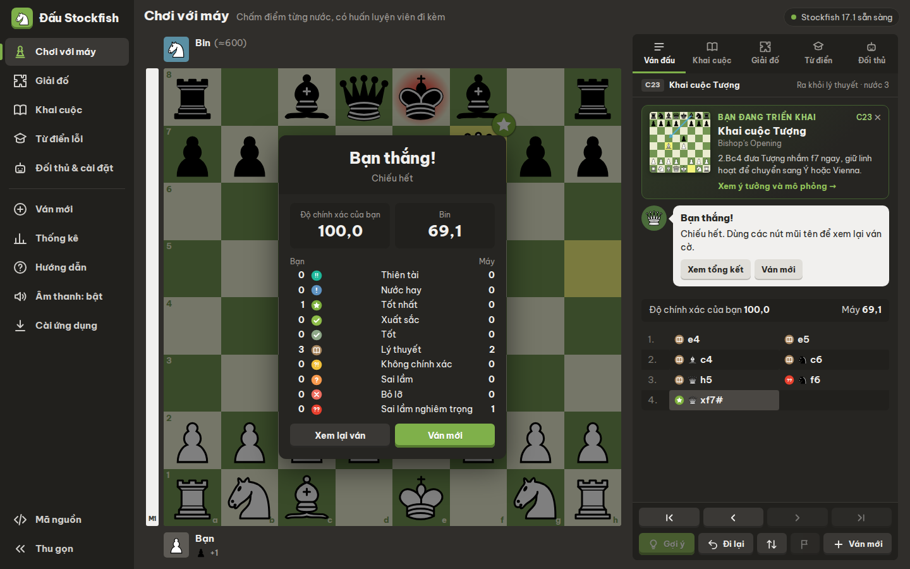 | 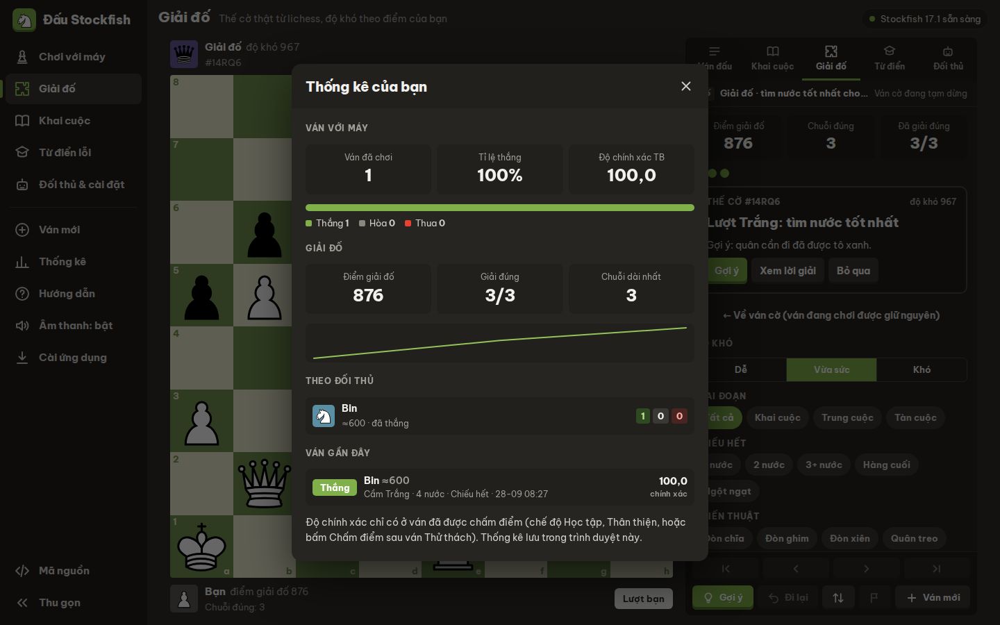 |
| *Accuracy and a count of every move class for both sides.* | *Results, accuracy, record per bot and puzzle rating.* |

| **Puzzles** | **Opening Library** |
|:---:|:---:|
| 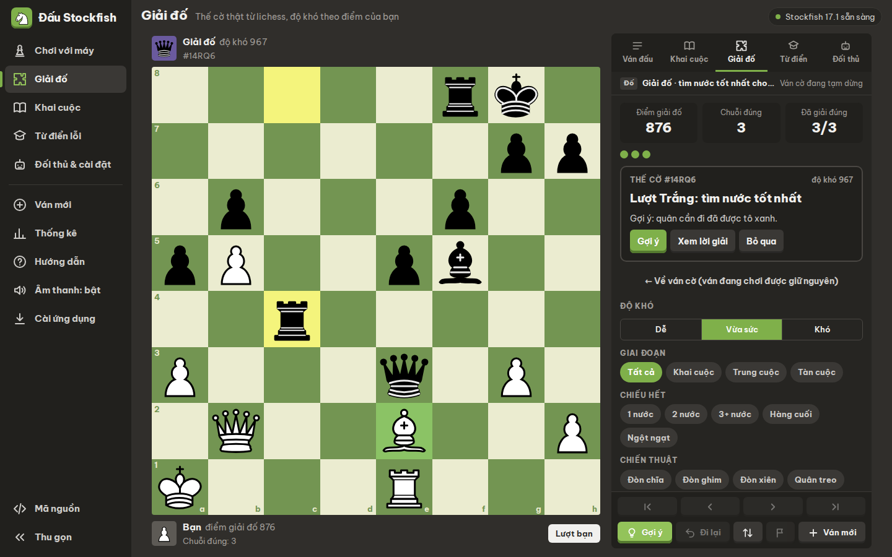 | 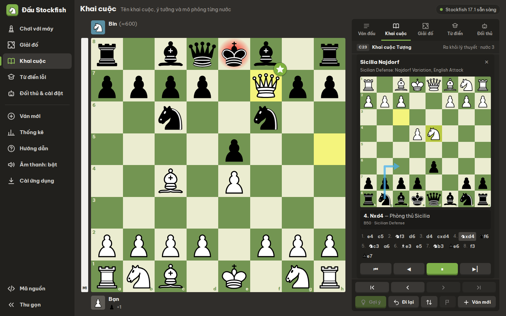 |
| *Real lichess puzzles with hints and a personal rating.* | *Step-by-step simulation of the Najdorf.* |

| **Mistake Dictionary** | **Opponents & Settings** |
|:---:|:---:|
| 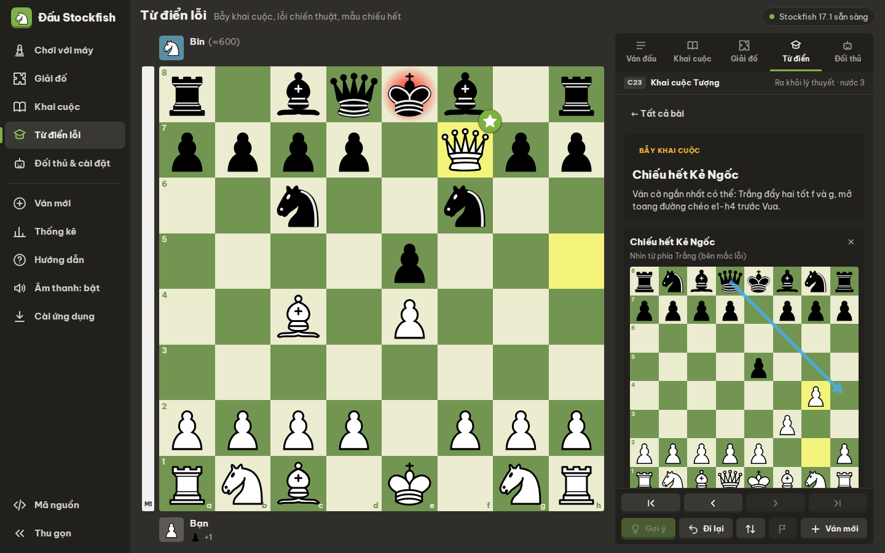 | 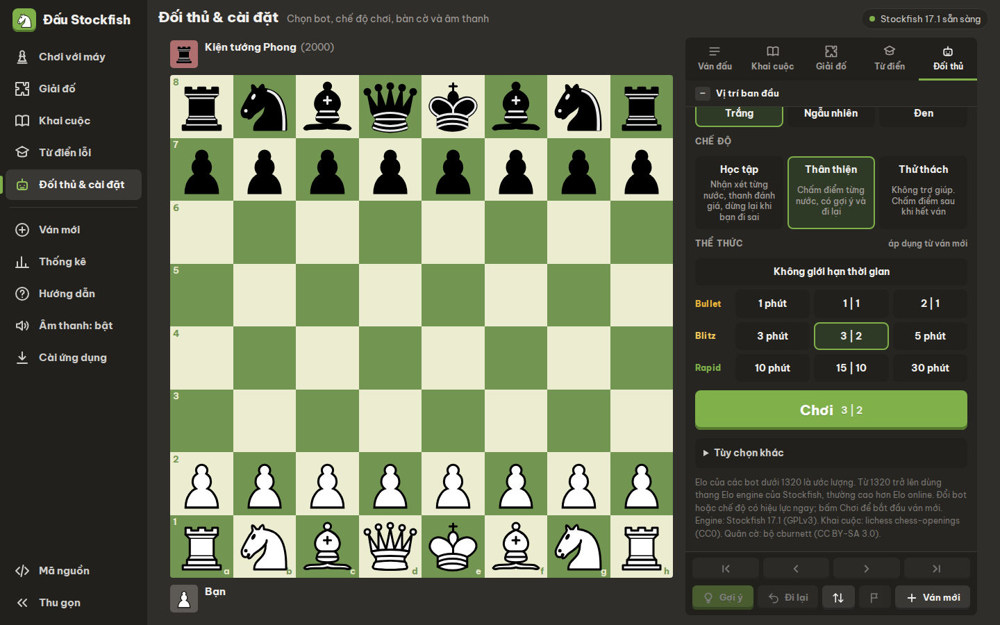 |
| *Each lesson replays the trap and explains how to avoid it.* | *Bots, side, mode, time control and board options.* |

### 📱 Mobile

| **Play With Clock** | **Menu** | **Puzzle** |
|:---:|:---:|:---:|
| 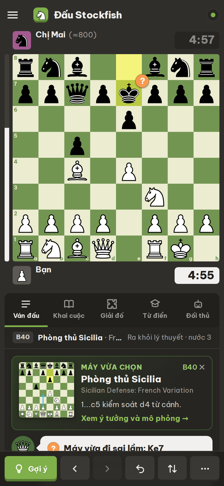 | 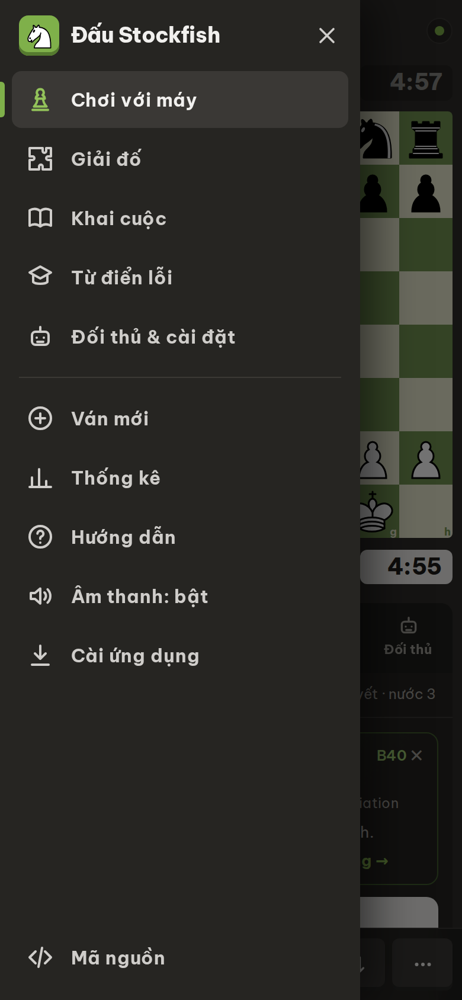 | 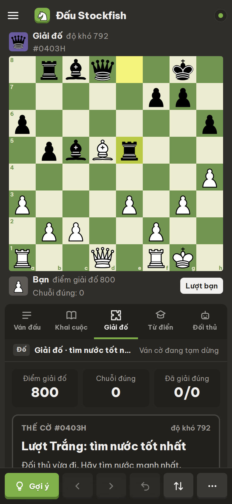 |
| *Clocks, opening card, bottom toolbar.* | *Slide-out navigation.* | *Puzzles on the main board.* |

---

## ⚙️ How It Works (Move Flow)

Everything runs in the browser. When you make a move, the app grades it with Stockfish, then asks the engine for the bot's reply:

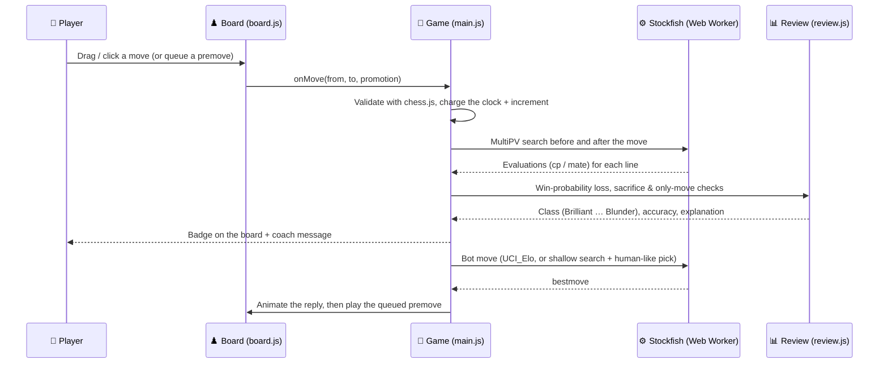

### Move Classification

Each move is compared with Stockfish's best move by **win probability**, using the lichess formula `Win% = 50 + 50 · (2 / (1 + e^(−0.00368208 · cp)) − 1)`. Losing a pawn in a balanced position therefore costs far more than in a decided one. Per-move accuracy is `103.1668 · e^(−0.04354 · Δ) − 3.1669`.

| Class | Symbol | Rule (Δ = win% lost) |
|-------|:------:|----------------------|
| Brilliant (Thiên tài) | `!!` | Δ ≤ 2 while leaving 2+ points of material en prise, and the position stays ≥ 45% |
| Great (Nước hay) | `!` | Engine's top move, and the second-best move is ≥ 12% worse |
| Best (Tốt nhất) | ★ | Engine's top move, or Δ ≤ 0.5 |
| Excellent / Good | ✓ | Δ ≤ 2 / Δ ≤ 5 |
| Book (Lý thuyết) | 📖 | In the opening book **and** the engine agrees it is sound |
| Inaccuracy / Mistake | `?!` / `?` | Δ ≤ 10 / Δ ≤ 20 |
| Miss (Bỏ lỡ) | ✕ | Failed to punish the opponent's mistake |
| Blunder | `??` | Δ > 20 |

### Engine Setup

- **Builds:** Stockfish 17.1 lite, multi-threaded when the page is `crossOriginIsolated` (SharedArrayBuffer), otherwise single-threaded, with an asm.js fallback.
- **Job queue:** Review, analysis and bot searches share one worker through a queue that waits for the previous `bestmove` after a `stop`, so no search is ever dropped.
- **Bots:** 1320+ Elo bots use `UCI_LimitStrength`. Weaker bots search to depth 1–8 over several MultiPV lines and pick with a softmax plus a blunder chance.

---

## 🤖 Opponents

| Bot | Elo | Style |
|-----|-----|-------|
| Bé Na · Tí · Bin | ≈250 · ≈400 · ≈600 | Beginners: hang pieces, forget the king, attack too early |
| Chị Mai · Chú Tư · Minh | ≈800 · ≈1000 · ≈1200 | Club players: principled, occasional slips, short tactics |
| Thầy Hùng · Kiện tướng Phong | 1500 · 2000 | Punish loose moves |
| Đại kiện tướng Quân · Stockfish 3000 | 2500 · 3000 | Master strength |
| Stockfish toàn lực · Siêu cấp | Full | No limit; Siêu cấp thinks 10 s per move |
| Tùy chỉnh | 1320–3190 | Any Elo you choose |

Ratings under 1320 are estimates. From 1320 up they use Stockfish's engine Elo scale, which usually sits above online ratings.

---

## ⌨️ Controls

| Key / Action | What It Does |
|--------------|--------------|
| `←` `→` or mouse wheel | Step through the moves |
| `H` | Hint (in puzzles: highlight the piece first, then show the arrow) |
| `G` | Take back to your last move |
| `F` | Flip the board |
| `N` / `Enter` | Next puzzle after solving |
| `Esc` | Clear arrows, hide the hint, close the menu |
| `?` | Open the help page |
| Right-drag / right-click | Draw an arrow / highlight a square (`Shift` green, `Ctrl` red, `Alt` blue) |
| Right-click on the bot's turn | Cancel premoves |
| Touch: hold, then drag | Draw an arrow on phones |

---

## 📂 Project Structure

```
chess-com/
├── index.html                  # App shell: icon sprite, menu, board, side panel, dialogs
├── app/
│   ├── main.js                 # Entry point: restore the saved game, bind the UI, start Stockfish
│   ├── core/                   # Shared foundation
│   │   ├── config.js           #   Modes, time controls, board themes, page titles
│   │   ├── state.js            #   The single app state object and read-only selectors
│   │   ├── storage.js          #   Save / restore game and preferences (localStorage)
│   │   └── util.js             #   Small DOM and chess helpers
│   ├── game/                   # Game rules and flow
│   │   ├── game.js             #   Moves, results, new game, takeback, resign, hints
│   │   ├── clock.js            #   Chess clocks, increments, time-outs
│   │   ├── puzzle.js           #   Puzzle mode on the main board
│   │   └── bots.js             #   Bot roster and human-like move picking
│   ├── analysis/               # Everything Stockfish
│   │   ├── engine.js           #   Web Worker controller (multi-thread / single / asm.js) and job queue
│   │   ├── scheduler.js        #   What the engine does next: reviews, live analysis, bot moves, premoves
│   │   └── review.js           #   Move classification, accuracy, coach explanations
│   ├── content/                # Learning content and data access
│   │   ├── openings.js         #   Opening lookups by position
│   │   ├── opening-guides.js   #   100+ Vietnamese opening guides
│   │   ├── opening-library.js  #   60-line opening library
│   │   ├── puzzles.js          #   Puzzle selection and puzzle rating
│   │   ├── lessons.js          #   Mistake dictionary (25 lessons)
│   │   └── hash.js             #   Position hashing for the opening data
│   ├── ui/                     # Rendering and input
│   │   ├── board.js            #   Board: drag & drop, premoves, arrows, highlights, animation
│   │   ├── main-board.js       #   What is drawn on the main board
│   │   ├── render.js           #   Player bars, eval bar, footer, tabs, game summary
│   │   ├── play-pane.js        #   Coach, hint, accuracy, opening card, move list
│   │   ├── panes.js            #   Openings, dictionary, puzzles, opponents & settings
│   │   ├── sim.js              #   Mini board that replays a line with captions
│   │   ├── menu.js, dialogs.js #   Main menu / drawer, stats and help dialogs
│   │   ├── controls.js         #   Clicks, keyboard shortcuts, mouse wheel
│   │   └── sound.js, pwa.js    #   Synthesized sounds & haptics, offline install
│   └── styles/                 # base, layout, board, panes, menu, dialogs, pieces (.css)
├── data/                       # openings.json, puzzles.json (compact lichess data)
├── engine/                     # Stockfish 17.1 builds (WASM single / multi-thread, asm.js)
├── lib/chess.js                # Rules and move generation
├── fonts/, icons/              # Be Vietnam Pro (Vietnamese subset), app icons
├── sw.js, manifest.webmanifest # Offline cache and install as an app (PWA)
├── vercel.json                 # COOP/COEP headers for threads, cache rules
├── tools/                      # Data builders, content checks, local server
└── images/                     # README screenshots
```

---

## 🛠️ Technology Stack

| Layer | Technologies |
|-------|-------------|
| **Chess Engine** | Stockfish 17.1 (WebAssembly, multi-threaded), in a Web Worker |
| **Rules** | chess.js |
| **Frontend** | Vanilla JavaScript (ES modules), HTML, CSS. No framework, no build step |
| **Data** | lichess chess-openings (3,815 lines), lichess puzzle database (5,706 puzzles) |
| **Offline & Install** | Service Worker, Web App Manifest (PWA) |
| **Audio** | Web Audio API |
| **Hosting** | Vercel (static, cross-origin isolation headers) |

---

## 🚀 How to Run Locally

### 1. Clone the repository

```bash
git clone https://github.com/HoangDuc1003/chess-com.git
cd chess-com
```

### 2. Start the local server

No install needed. The bundled server sends the same COOP/COEP headers as `vercel.json`, so Stockfish can use several threads:

```bash
python3 tools/serve.py 8080
# open http://localhost:8080
```

`python3 -m http.server` also works, but Stockfish then runs on one thread.

### 3. Rebuild data and run checks (optional)

```bash
node tools/build-openings.mjs path/to/chess-openings    # clone of lichess-org/chess-openings
python3 tools/build-puzzles.py path/to/lichess_db_puzzle.csv
node tools/build-check.mjs      # replays every dictionary lesson and checks it with Stockfish
node tools/check-library.mjs    # replays every opening-library line
```

### 4. Deploy to Vercel

1. Import the `chess-com` repository **once** at https://vercel.com/new (Framework Preset: **Other**, no build command).
2. Name the project `chess-training-com`. Every push to `main` redeploys automatically.

`vercel.json` already sets the isolation headers for multi-threading and long-term caching for the engine and fonts.

---

## 📜 Credits & License

- Source code: **GPL-3.0** (see [`LICENSE`](./LICENSE)), because the project ships Stockfish.
- [Stockfish](https://stockfishchess.org) 17.1 via [stockfish.js](https://github.com/nmrugg/stockfish.js) (GPL-3.0).
- [chess.js](https://github.com/jhlywa/chess.js) (BSD-2-Clause).
- Openings: [lichess-org/chess-openings](https://github.com/lichess-org/chess-openings) (CC0). Puzzles: [lichess puzzle database](https://database.lichess.org/#puzzles) (CC0).
- Pieces: cburnett set by Colin M.L. Burnett (CC BY-SA 3.0). Font: Be Vietnam Pro (SIL OFL 1.1).

Personal learning project, not affiliated with Chess.com, lichess.org or the Stockfish team.

---

## 👨‍💻 Author

**Nguyễn Đức Hoàng**

- GitHub: [@HoangDuc1003](https://github.com/HoangDuc1003)
- Focus: Backend Development & High-Performance Computing

If you found this project helpful, please give it a ⭐!
